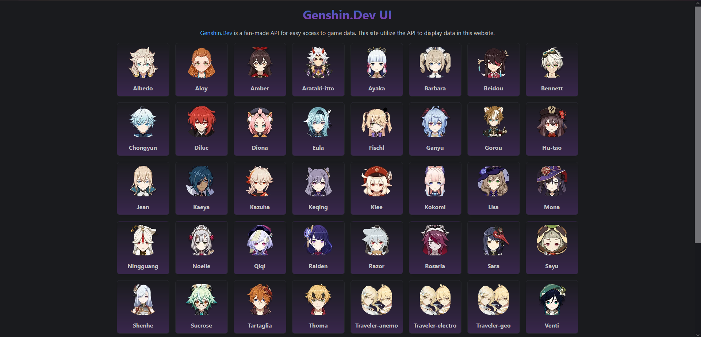
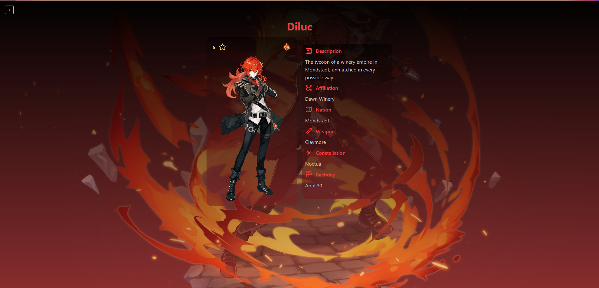

# GenshinDev Ui

frontend wrapper for genshindev API
## Screenshots

  
   

## Features

- show characters
- Animation on cards
- view character info
- sick design on char info

## Built with

- React
- Typescript
- Mantine Ui
- genshin.dev API
- Framer Motion

## License

This project is licensed under the GPL-3.0 - see the license file for more details
